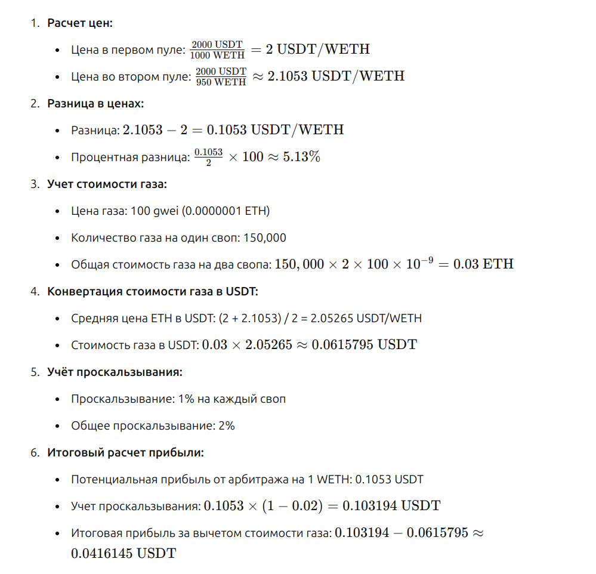

# Арбитражная возможность на Uniswap V2

Этот скрипт анализирует цены токена (например, ETH) в паре с USDT на двух разных пулах Uniswap V2 и определяет, существует ли возможность для арбитража.

## Установка

1. Убедитесь, что у вас установлен Python 3.
2. Установите необходимые зависимости:
3. Проскальзывание можно установить в переменной slippage, а цену за свап в swap_gas_estimate
```bash
pip install -r requirements.txt
```
## Запуск
```bash
python arbitrage.py 
```
## Атомарный свап
Для ознакомления с решением атомарного свапа используется смартконтракт, который не был протестирован
и содержит основную идею, что вычисляемые параметры влияет на то будет ли исполнена транзакция или будет 
отвергнута 

